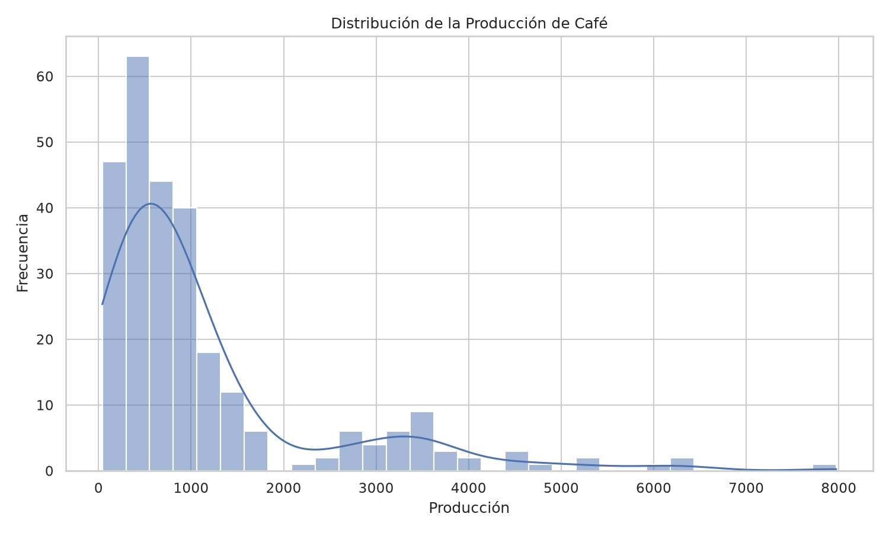
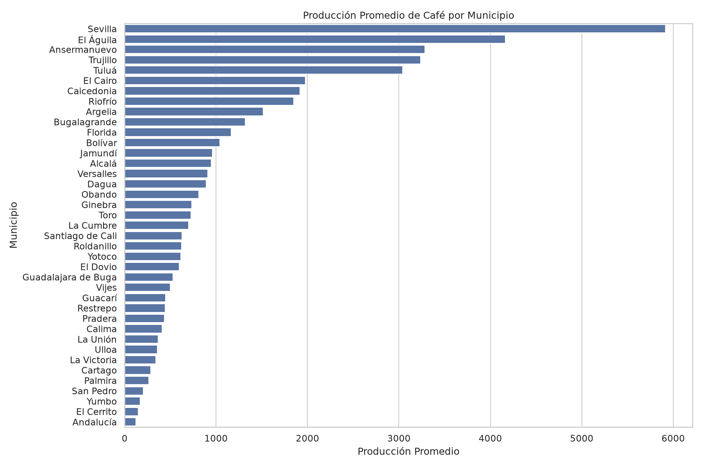
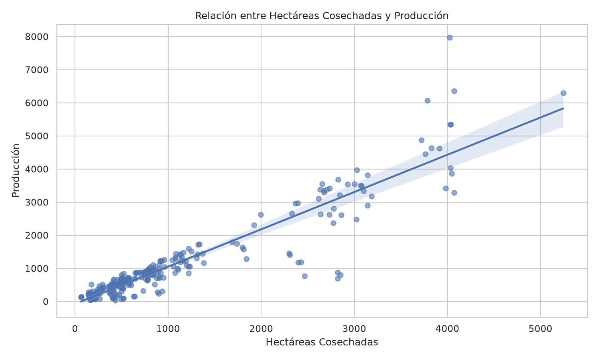

# Proyecto IA – Preparación y Análisis de Datos con Pandas y Seaborn


El objetivo es aplicar técnicas de análisis, limpieza, visualización y preparación de datos para Machine Learning utilizando **Python, Pandas, NumPy, Seaborn y Docker**.

El proyecto contiene dos actividades:

1. Una actividad práctica de preparación de datos utilizando un dataset de ventas.
2. Una actividad independiente aplicada al dataset real del proyecto de **Predicción de la Producción de Café en Cartago, Valle del Cauca**.

---

## Tecnologías utilizadas

* Python 3.12
* Pandas
* NumPy
* Matplotlib
* Seaborn
* Docker
* Docker Compose
* WSL 2 (Ubuntu)
* Visual Studio Code
* Git y GitHub

---

## Estructura del proyecto

```text
ia-python/
├── docker-compose.yml
├── Dockerfile
├── requirements.txt
├── README.md
├── .gitignore
├── .dockerignore
│
└── clase8/
    ├── data/
    │   ├── cafe_valle_limpio.csv
    │   ├── cafe_preparado_ml.csv
    │   ├── distribucion_produccion_cafe.png
    │   ├── produccion_por_municipio.png
    │   ├── hectareas_vs_produccion_cafe.png
    │   ├── ventas_tienda.csv
    │   ├── ventas_preparadas_ml.csv
    │   ├── distribucion_ventas.png
    │   ├── ventas_por_categoria.png
    │   └── edad_vs_venta.png
    │
    └── src/
        ├── preparacion_datos.py
        └── preparacion_cafe.py
```

---

## Cómo ejecutar el proyecto

### 1. Construir la imagen Docker

```bash
docker compose build
```

### 2. Levantar el contenedor

```bash
docker compose up -d
```

### 3. Verificar el contenedor

```bash
docker ps
```

El contenedor utilizado en el proyecto se llama:

```text
ia_python
```

### 4. Ejecutar la actividad de ventas

```bash
docker exec -it ia_python python clase8/src/preparacion_datos.py
```

### 5. Ejecutar la actividad independiente de café

```bash
docker exec -it ia_python python clase8/src/preparacion_cafe.py
```

---

# Actividad práctica: Preparación de datos de ventas

La primera actividad utiliza el archivo:

```text
clase8/data/ventas_tienda.csv
```

El proceso se realiza mediante el script:

```text
clase8/src/preparacion_datos.py
```

### Exploración

Se utilizaron las siguientes funciones de Pandas:

* `head()`
* `info()`
* `describe()`
* `isnull().sum()`

El dataset contiene **12 filas y 9 columnas**.

Durante la exploración se encontraron **2 valores nulos en la columna `cliente_edad`**.

### Limpieza

Los valores faltantes de `cliente_edad` fueron reemplazados utilizando la **mediana**, cuyo valor fue **36**.

También se creó la columna derivada:

```text
total_venta
```

Esta columna se obtiene a partir del precio unitario y la cantidad vendida.

### Codificación

Se utilizó `pd.get_dummies()` para realizar **One-Hot Encoding** de las variables categóricas:

* `categoria`
* `metodo_pago`

El resultado se guardó en:

```text
clase8/data/ventas_preparadas_ml.csv
```

### Visualizaciones

Se generaron tres gráficos utilizando Seaborn:

* `distribucion_ventas.png`
* `ventas_por_categoria.png`
* `edad_vs_venta.png`

---

# Preparación de Datos

## Actividad independiente: Dataset de producción de café


```text
clase8/data/cafe_valle_limpio.csv
```

Este dataset contiene información de la producción cafetera de municipios del **Valle del Cauca** durante el período **2019–2025**.

El proceso se realizó mediante:

```text
clase8/src/preparacion_cafe.py
```

---

## 1. Carga y exploración de datos

Los datos fueron cargados utilizando:

```python
pd.read_csv()
```

El dataset contiene:

* **273 filas**
* **7 columnas**

Las columnas originales son:

* `codigo_municipio`
* `municipio`
* `año`
* `hectareas_sembradas`
* `hectareas_cosechadas`
* `produccion`
* `rendimiento`

Para explorar los datos se utilizaron:

```python
df.head()
df.info()
df.describe()
df.isnull().sum()
```

---

## 2. Hallazgos del análisis

Uno de los principales hallazgos es que la producción presenta una variación importante entre los registros.

La producción promedio es de aproximadamente **1.143,60**, mientras que el valor mínimo es **40,02** y el máximo es **7.972,98**.

Esto muestra que existen diferencias importantes en los niveles de producción entre los municipios y años analizados.

El dataset contiene información desde **2019 hasta 2025**.

---

## 3. Manejo de valores nulos

Se realizó una revisión mediante:

```python
df.isnull().sum()
```

El resultado mostró que **no existen valores nulos** en ninguna de las columnas del dataset.

Por lo tanto, no fue necesario realizar imputaciones o eliminar registros.

---

## 4. Creación de una columna derivada

Como parte de la preparación se creó la columna:

```text
porcentaje_cosecha
```

Esta variable representa el porcentaje de hectáreas cosechadas respecto a las hectáreas sembradas.

La nueva variable permite analizar qué proporción del área sembrada llegó efectivamente a la etapa de cosecha.

---

## 5. Codificación de variables categóricas

La columna `municipio` es una variable categórica.

Para convertirla a una representación adecuada para Machine Learning se utilizó:

```python
pd.get_dummies()
```

Se generaron variables binarias para los municipios, por ejemplo:

```text
municipio_Alcalá
municipio_Cartago
...
```

También se eliminó `codigo_municipio`, debido a que es un identificador y no debe interpretarse como una variable numérica continua.

---

## 6. Visualización con Seaborn

## 6. Visualización con Seaborn

Se generaron tres visualizaciones utilizando Seaborn.

### Distribución de la producción



Este gráfico permite observar cómo se distribuyen los valores de producción del dataset.

### Producción promedio por municipio



Este gráfico permite comparar la producción promedio entre los diferentes municipios.

### Hectáreas cosechadas vs producción



Este gráfico permite analizar la relación entre el número de hectáreas cosechadas y la producción obtenida. Se incluye una línea de regresión para observar la tendencia general.

## 7. Dataset preparado para Machine Learning

Después de realizar la limpieza, creación de variables y codificación categórica, se obtuvo un dataset preparado para Machine Learning.

Archivo generado:

```text
clase8/data/cafe_preparado_ml.csv
```

El resultado final contiene:

* **273 filas**
* **45 columnas**
* **0 valores nulos**

El aumento de 7 a 45 columnas se debe principalmente al proceso de **One-Hot Encoding** aplicado a la variable `municipio`.

---

## Conclusión

La preparación de datos permitió transformar el dataset original de producción cafetera en un conjunto de datos estructurado y preparado para posteriores procesos de Machine Learning.

Se aplicaron técnicas de:

* Carga de datos con Pandas.
* Exploración de información.
* Análisis estadístico.
* Detección de valores nulos.
* Creación de variables derivadas.
* Codificación One-Hot.
* Visualización con Seaborn.
* Preparación de un dataset para Machine Learning.

El resultado final es:

```text
cafe_preparado_ml.csv
```

con **273 registros, 45 variables y ningún valor nulo**.
